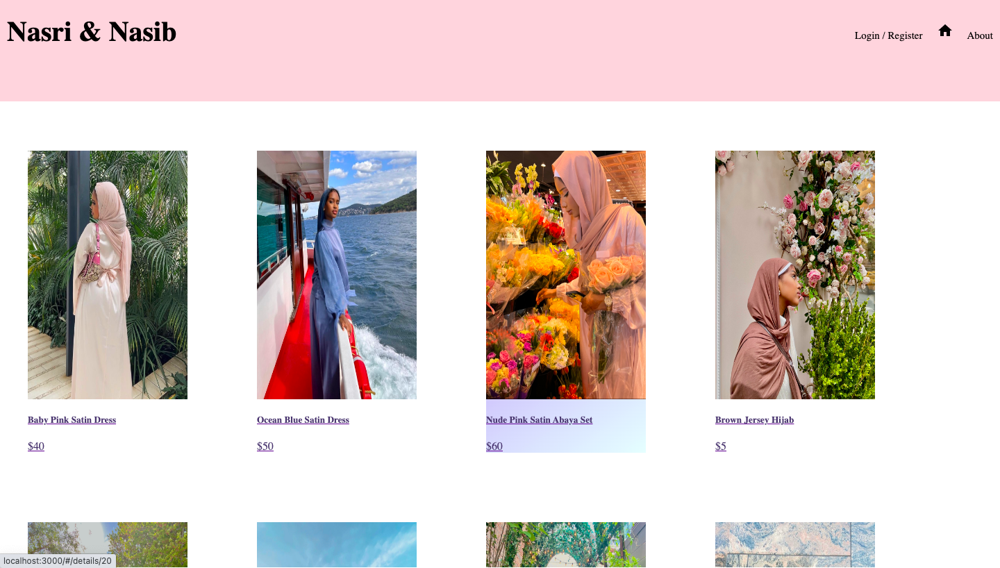

## Nasri and Nasib

I developed this web app to serve as a catalog for customers that come to my mom's store. 
My mom has a little clothing store in St. Paul and a lot of the time I'm the one spreading the word for her small business. People often ask me what the clothes look like and I usually don't have a visual representation to show them. So to solve that problem I created this application.

## Capabilities and Usage 

Users will be able to see all items sold when visiting the website an upon clicking on the an individual item customers will be taken to a detailed veiw where they can see things like the size, color, fabric, fit etc. Users will then be able to add to items to their wishlist if they register and are logged in .They can keep items saved to know what to get when shopping at the store. This application also has an admin section. The admin has the ability to delete items that are out of stock and edit items as needed.

## Screenshots

## Installations

1. To set up the database create a new databases called "prime_app" in postgresql. The queries needed are in the database.sql file.
2. Open up your terminal and run "npm install"
3. also run "npm run server" and npm run client" in your terminal. Browser will then automatically open the application.

## Usage

Once on the landing page users can see all the items listed. There is a navigation bar at the top of the page that allows users to login, log out, got the home page and wishlist page. Users can click on the items listed and see detailed information about the products. If logged in users will be able to add products that the like to a wishlist. Users that are logged in can view all the items saved in their wishlist by clicking on the heart button on the navigation bar.

## Built with 

HTML
CSS
JavaScript
React 
Redux - Saga
PostgreSQL
Material UI
Sweet Alerts

## Acknowledgements
The Jemisin cohort, Our supportive instrutor Liz and everyone at Prime Digital Academy.

## Support
If you have any questions, feel free to email me at miskiali222@gmail.com
